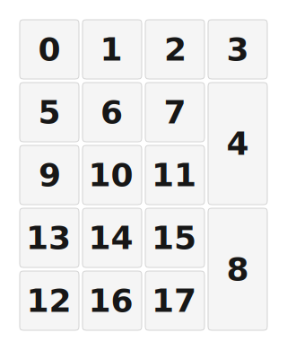

# ZMK Configuration for atanumpad

*Generated by Shield Wizard for ZMK*



Download compiled firmware from the Actions tab. <https://zmk.dev/docs/user-setup#installing-the-firmware>

Edit your keymap <https://zmk.dev/docs/keymaps>.
User keymap is located at [`config/atanumpad.keymap`](config/atanumpad.keymap).

-----

<details>
<summary>
Shield Wizard Debug Information
</summary>

In case of broken configuration, here is the Shield Wizard internal data used to generate this configuration:

Commit: 63ab9b7bd8845252979f45da72f40210b0b1a3ae

```json
{"name":"atanumpad","shield":"atanumpad","dongle":false,"modules":[],"layout":[{"id":"01KTSR9CBJPQEBX2AP4CNKCKVV","part":0,"row":0,"col":0,"w":1,"h":1,"x":0,"y":0,"r":0,"rx":0,"ry":0},{"id":"01KTSR9CJ2E8ADP56FPRJYYV98","part":0,"row":0,"col":1,"w":1,"h":1,"x":1,"y":0,"r":0,"rx":0,"ry":0},{"id":"01KTSR9CT6ZQ6HA3SX3P8AFJ5Y","part":0,"row":0,"col":2,"w":1,"h":1,"x":2,"y":0,"r":0,"rx":0,"ry":0},{"id":"01KTSR9D3XCDCFKX1ZZSWAP6M1","part":0,"row":0,"col":3,"w":1,"h":1,"x":3,"y":0,"r":0,"rx":0,"ry":0},{"id":"01KTSR9XEEB1ZXVZPSAREBNR3A","part":0,"row":0,"col":4,"w":1,"h":2,"x":3,"y":1,"r":0,"rx":0,"ry":0},{"id":"01KTSR9XMBQ2RVHD20P1Q95G85","part":0,"row":0,"col":5,"w":1,"h":1,"x":0,"y":1,"r":0,"rx":0,"ry":0},{"id":"01KTSR9XT8H6E35FEESXA87PH6","part":0,"row":0,"col":6,"w":1,"h":1,"x":1,"y":1,"r":0,"rx":0,"ry":0},{"id":"01KTSR9Y04FT65X5F5JRC4ZMVD","part":0,"row":0,"col":7,"w":1,"h":1,"x":2,"y":1,"r":0,"rx":0,"ry":0},{"id":"01KTSR9Y5GRA53T8NK66XWP3TR","part":0,"row":0,"col":8,"w":1,"h":2,"x":3,"y":3,"r":0,"rx":0,"ry":0},{"id":"01KTSR9YAV6WPB9GM3S5A52YVH","part":0,"row":0,"col":9,"w":1,"h":1,"x":0,"y":2,"r":0,"rx":0,"ry":0},{"id":"01KTSR9YH4PR49T8FQDR4P2E7D","part":0,"row":0,"col":10,"w":1,"h":1,"x":1,"y":2,"r":0,"rx":0,"ry":0},{"id":"01KTSR9YPYK8D1F0R9HQ3ES5GR","part":0,"row":0,"col":11,"w":1,"h":1,"x":2,"y":2,"r":0,"rx":0,"ry":0},{"id":"01KTSR9YWMRQ4WEGDHNFSHNMRG","part":0,"row":0,"col":12,"w":1,"h":1,"x":0,"y":4,"r":0,"rx":0,"ry":0},{"id":"01KTSR9Z2N0NHY8WGTE9DQ196W","part":0,"row":0,"col":13,"w":1,"h":1,"x":0,"y":3,"r":0,"rx":0,"ry":0},{"id":"01KTSR9Z8JZVCRDD5MBHP7R394","part":0,"row":0,"col":14,"w":1,"h":1,"x":1,"y":3,"r":0,"rx":0,"ry":0},{"id":"01KTSR9ZEA8GXPNPRSXX05TPHM","part":0,"row":0,"col":15,"w":1,"h":1,"x":2,"y":3,"r":0,"rx":0,"ry":0},{"id":"01KTSR9ZSM0YFNHGT5ARZCF8SE","part":0,"row":0,"col":16,"w":1,"h":1,"x":1,"y":4,"r":0,"rx":0,"ry":0},{"id":"01KTSRA078QYM9BNHGCC6MXVNS","part":0,"row":0,"col":17,"w":1,"h":1,"x":2,"y":4,"r":0,"rx":0,"ry":0}],"parts":[{"name":"unibody","controller":"nice_nano_v2","wiring":"matrix_diode","pins":{"d19":"input","d20":"input","d4":"input","d5":"input","d2":"output","p102":"output","p101":"output","d16":"output","d10":"output"},"keys":{"01KTSR9D3XCDCFKX1ZZSWAP6M1":{"input":"d19","output":"d2"},"01KTSR9XEEB1ZXVZPSAREBNR3A":{"input":"d19","output":"p101"},"01KTSR9Y5GRA53T8NK66XWP3TR":{"input":"d19","output":"d10"},"01KTSR9CT6ZQ6HA3SX3P8AFJ5Y":{"input":"d20","output":"d2"},"01KTSR9Y04FT65X5F5JRC4ZMVD":{"input":"d20","output":"p102"},"01KTSR9YPYK8D1F0R9HQ3ES5GR":{"input":"d20","output":"p101"},"01KTSR9ZEA8GXPNPRSXX05TPHM":{"input":"d20","output":"d16"},"01KTSRA078QYM9BNHGCC6MXVNS":{"input":"d20","output":"d10"},"01KTSR9CJ2E8ADP56FPRJYYV98":{"input":"d4","output":"d2"},"01KTSR9XT8H6E35FEESXA87PH6":{"input":"d4","output":"p102"},"01KTSR9YH4PR49T8FQDR4P2E7D":{"input":"d4","output":"p101"},"01KTSR9Z8JZVCRDD5MBHP7R394":{"input":"d4","output":"d16"},"01KTSR9ZSM0YFNHGT5ARZCF8SE":{"input":"d4","output":"d10"},"01KTSR9CBJPQEBX2AP4CNKCKVV":{"input":"d5","output":"d2"},"01KTSR9XMBQ2RVHD20P1Q95G85":{"input":"d5","output":"p102"},"01KTSR9YAV6WPB9GM3S5A52YVH":{"input":"d5","output":"p101"},"01KTSR9Z2N0NHY8WGTE9DQ196W":{"input":"d5","output":"d16"},"01KTSR9YWMRQ4WEGDHNFSHNMRG":{"input":"d5","output":"d10"}},"encoders":[],"buses":[{"name":"spi0","devices":[],"type":"spi"},{"name":"spi1","devices":[],"type":"spi"},{"name":"spi2","devices":[],"type":"spi"},{"name":"spi3","devices":[],"type":"spi"},{"name":"i2c0","devices":[],"type":"i2c"},{"name":"i2c1","devices":[],"type":"i2c"}]}]}
```

</details>
